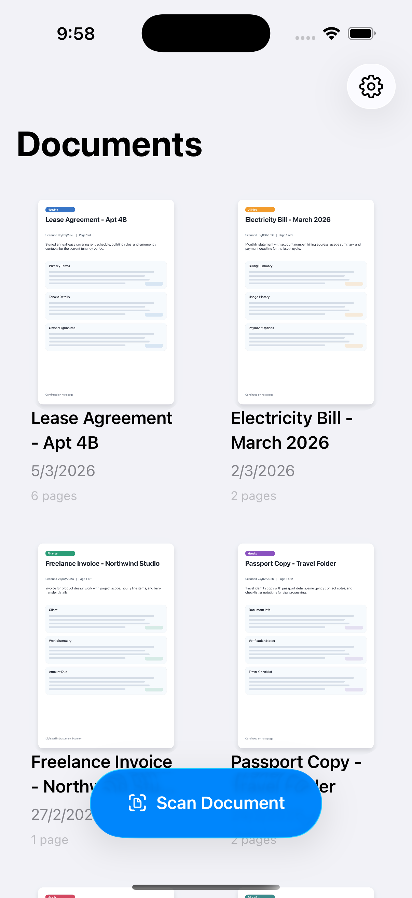
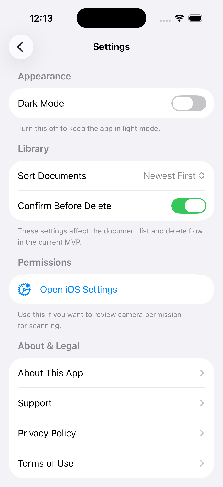

# document-scanner-native-ios-app

document-scanner-native-ios-app is a local first iOS app for capturing paper documents, converting them into PDFs, and managing them in a clean SwiftUI interface. The project is open source and built for a focused scanning workflow without accounts, cloud dependencies, or unnecessary complexity.

## Preview

| Home | Settings |
| --- | --- |
|  |  |

## Features

- Scan paper documents with VisionKit on a physical iPhone or iPad
- Convert multi page scans into PDF files automatically
- Create searchable PDFs with offline on-device OCR
- Store PDFs and preview images locally on the device
- Browse saved scans in a simple document library
- Preview, share, rename, and delete scanned documents
- Choose PDF export quality before sharing with Low, Medium, High, and Very High presets
- See the expected shared file size before exporting a document
- Preserve selectable and searchable text in exported PDFs when OCR is available
- Control sort order, export quality, delete confirmation, and appearance preferences
- Choose OCR language preferences for offline text recognition
- Keep the experience local first with no account system or cloud sync

## Tech Stack

- Swift 5
- SwiftUI
- VisionKit
- PDFKit
- UIKit interoperability where needed for scanning and preview

## Project Structure

```text
document-scanner-native-ios-app/
├── document-scaner/
│   ├── Features/
│   ├── Models/
│   ├── Services/
│   └── Shared/
├── marketing/
│   └── screenshots/
└── document-scaner.xcodeproj
```

## Getting Started

### Requirements

- macOS with Xcode installed
- A physical iPhone or iPad for document scanning
- The project is currently configured with an iOS deployment target of 26.2 in Xcode

### Installation

```bash
git clone https://github.com/youssefsz/document-scanner-native-ios-app.git
cd document-scanner-native-ios-app
open document-scaner.xcodeproj
```

### Run the App

1. Open the project in Xcode.
2. Select an iPhone or iPad target.
3. Build and run the app.
4. Grant camera permission when prompted.

Note: the simulator can build and preview the interface, but document capture requires a physical device with camera access.

## Privacy

This project follows a local first approach. Scanned PDFs, preview images, OCR processing, and metadata stay on the device. The app does not require user accounts or upload documents to a backend service.

## Recent Updates

- Searchable PDF export now uses offline on-device OCR with embedded text layers for search and selection in compatible PDF readers
- Export quality presets preserve searchable text while producing separate PDF variants for lower and higher quality sharing
- OCR language preferences can be configured in Settings

## Open Source

This project is open source and maintained by Youssef Dhibi.

- Portfolio: [dhibi.tn](https://dhibi.tn)

## License

This project is licensed under the MIT License. See the [LICENSE](LICENSE) file for details.
