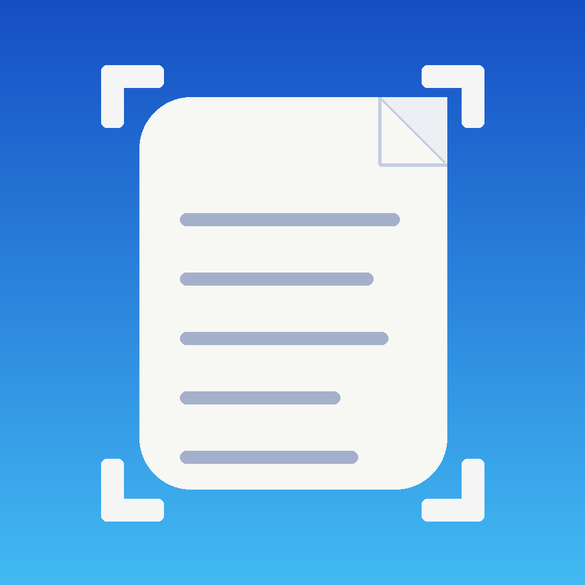
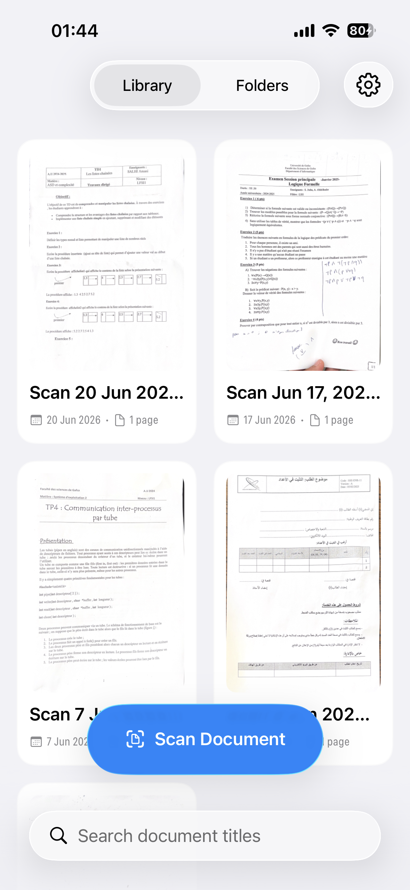
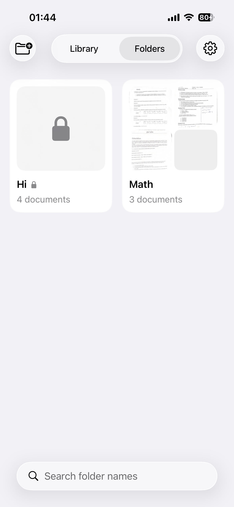
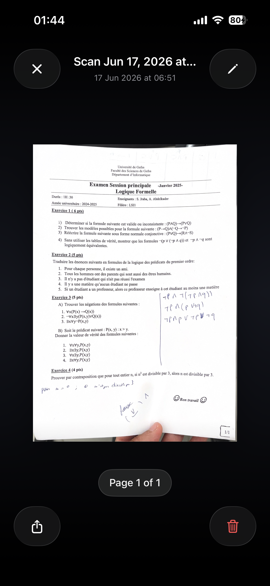
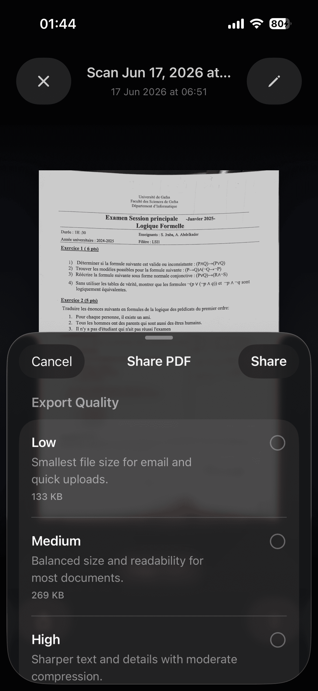
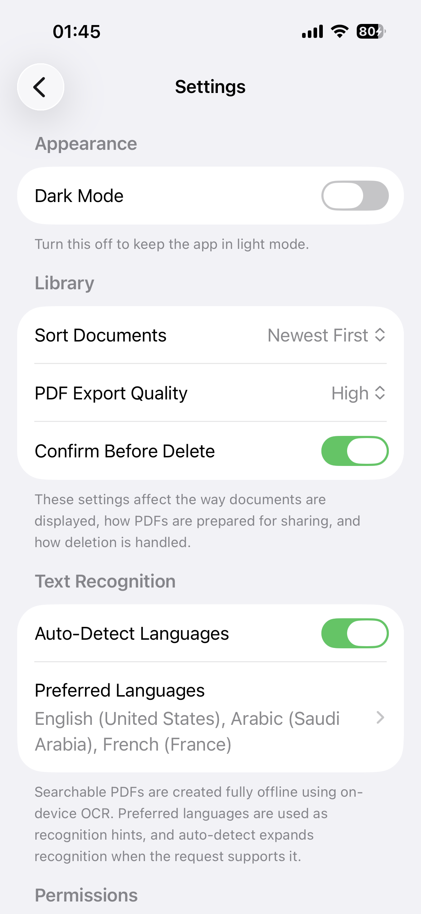

<p align="center">
  
</p>

<h1 align="center">DocScanner: PDF Scan</h1>

<p align="center">
  A private, local-first document scanner for iPhone and iPad.<br>
  Scan paper, recognize text, organize PDFs, and protect sensitive documents without an account or developer-operated cloud storage.
</p>

<p align="center">
  <a href="https://apps.apple.com/app/id6760237829"></a>
  
  
  <a href="LICENSE"></a>
  <a href="CONTRIBUTING.md"></a>
</p>

<p align="center">
  <a href="https://youssef.tn/DocScanner/">Website</a>
  · <a href="https://apps.apple.com/app/id6760237829">App Store</a>
  · <a href="legal/privacy-policy.md">Privacy</a>
  · <a href="SUPPORT.md">Support</a>
  · <a href="CONTRIBUTING.md">Contributing</a>
</p>

## The app

DocScanner turns multi-page camera captures into PDFs and keeps the library on the device. Offline OCR adds a selectable, searchable text layer. Folders, search, quality presets, and the iOS share sheet cover the rest of the everyday workflow.

Sensitive documents can live in secure folders protected by Face ID, Touch ID, or the device passcode. DocScanner encrypts secure-folder titles, PDFs, and previews on-device. It can also create password-protected copies for sharing without changing the saved original.

The app does not require an account, include third-party advertising or analytics SDKs, or upload documents to a server operated by the developer.

## Screenshots

<p align="center">
  
  
  
  
  
</p>

## What is included

- Multi-page document capture with VisionKit
- Local PDF storage, folders, search, rename, preview, and sharing
- Offline OCR with searchable and selectable PDF text
- Low, Medium, High, and Very High export-quality presets
- Secure folders backed by Keychain, CryptoKit, and system authentication
- Password-protected PDF export copies
- One-time DocScanner Pro purchase through StoreKit 2
- iPhone and iPad layouts with light and dark appearance support

## Technology

DocScanner is a native SwiftUI app. It uses VisionKit for capture, Vision for OCR, PDFKit for PDF reading and writing, Core Data for library metadata, and CryptoKit plus Keychain for secure folders. There are no third-party runtime dependencies.

## Build from source

### Requirements

- macOS with Xcode 26.2 or later
- iOS 16.0 or later
- An iPhone or iPad for camera-based document capture

The app builds and its non-camera flows run in the simulator. VisionKit document capture requires a physical device with a camera.

### Setup

```bash
git clone https://github.com/youssefsz/document-scanner-native-ios-app.git
cd document-scanner-native-ios-app
open document-scaner.xcodeproj
```

Select the `document-scaner` scheme and an iOS destination, then build with <kbd>⌘B</kbd> or run with <kbd>⌘R</kbd>. The checked-in StoreKit configuration supplies the development product identifier. For local overrides, copy `Config/LocalOverrides.xcconfig.example` to `Config/LocalOverrides.xcconfig`.

Run the test suite from Xcode with <kbd>⌘U</kbd>, or from the command line with an installed simulator:

```bash
xcodebuild test \
  -project document-scaner.xcodeproj \
  -scheme document-scaner \
  -destination 'platform=iOS Simulator,name=iPhone 16e'
```

## Project layout

```text
.
├── Config/                  StoreKit and local build configuration
├── document-scaner/        App source and asset catalogs
│   ├── Features/           Scanner, library, detail, settings, onboarding
│   ├── Models/             Library and document models
│   ├── Services/           Storage, OCR, export, purchases, and security
│   └── Shared/             Shared views, metadata, and preferences
├── document-scanerTests/   XCTest suite and migration fixtures
├── landing-page/           Product website
├── legal/                  Privacy policy and terms of use
└── marketing/              App Store and campaign assets
```

## Privacy and security

Document processing and storage happen on-device. Secure folders use a versioned encrypted format with transactional recovery. Read the [security design](docs/SECURITY_DESIGN.md) for implementation details and the [security policy](SECURITY.md) before reporting a vulnerability.

Deleting the app or losing a device without a usable backup can make secure documents unrecoverable. Export a separate copy of anything important.

## Contributing

Bug reports and focused pull requests are welcome. Start with [CONTRIBUTING.md](CONTRIBUTING.md), follow the [code of conduct](CODE_OF_CONDUCT.md), and use the repository templates when opening an issue or pull request. You can also see the [people who have contributed](https://github.com/youssefsz/document-scanner-native-ios-app/graphs/contributors).

## License

The source code is available under the [MIT License](LICENSE).

The original app icon, logo artwork, screenshots, and marketing images are not included in that grant. Read the [visual asset policy](BRAND_ASSETS.md) before reusing project artwork. The App Store build remains subject to Apple's terms and the app's [Terms of Use](legal/terms-of-use.md).

Copyright © 2026 [Youssef Dhibi](https://dhibi.tn).
